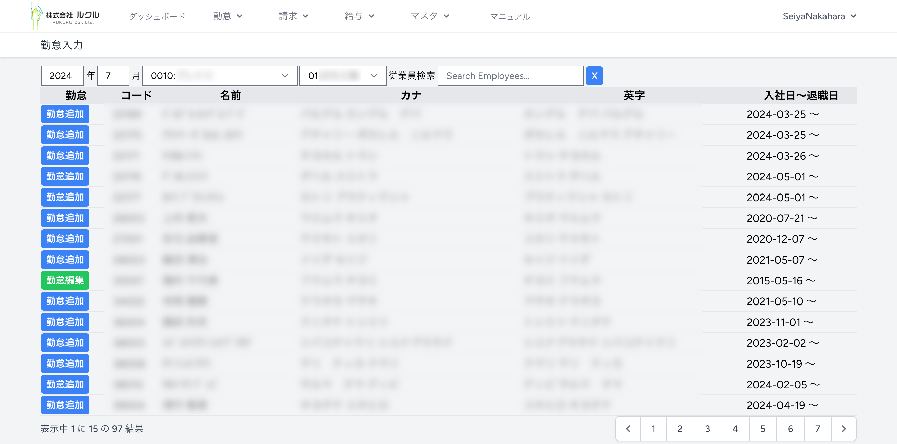
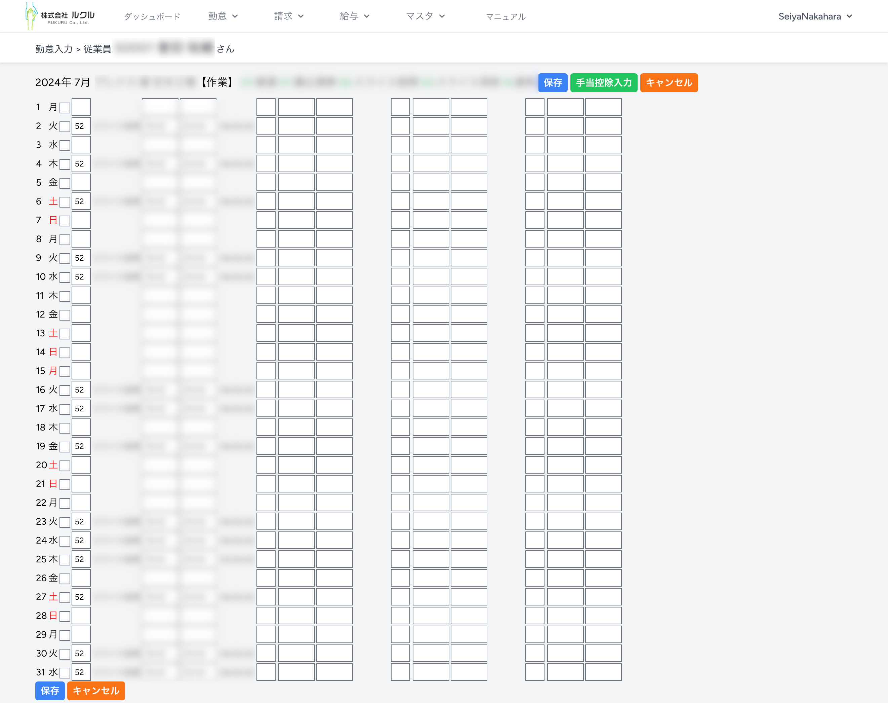

### 3. 勤怠入力
#### 3.1. 勤怠取込

> [!TIP]
> 将来のバージョンで勤怠打刻データ CSV を取り込めるようになります。
#### 3.２. 勤怠入力
勤怠を入力するには、上部メニューで勤怠＞勤怠入力を選んでください。

勤怠入力は、年月、顧客と事業所を選択したうえで、従業員ごとに作業種別と開始、終了時刻を入力します。

［勤怠追加］［勤怠編集］をクリックすると、従業員の日にちごとの作業種別と開始、終了時刻を入力する画面が表示されます。

クラムシェルに従業員番号と氏名が表示されます。
勤怠入力の上に年月、顧客と事業所、入力できる作業種別の一覧が表示されます。

［保存］をクリックすると入力内容が保存されます。

［手当控除入力］をクリックすると、この従業員の、この年月の手当控除金額入力画面に移動します。

有給取得日は、曜日右側のチェックボックスをチェックしてください。

勤怠入力では、一日あたり４つのブロックを登録できるようになっています。
各ブロックには、次の３つの入力項目があります。
* 作業種別
* 打刻開始時刻
* 打刻終了時刻

作業種別を入力すると作業種別の名前が表示されます。
打刻開始、終了時刻を両方入力すると勤務時間が表示されます。
#### 3.３. 勤怠締め
年月を指定して勤怠締め処理行って、請求額と従業員の給与を計算します。

勤怠締め処理が成功すると、請求出力や給与計算を行うことができます。
