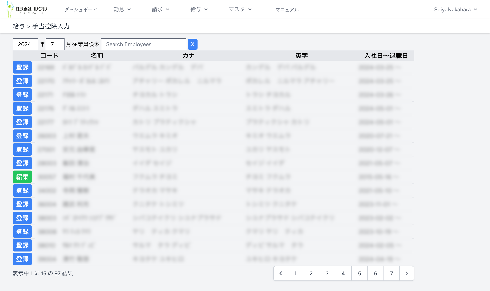
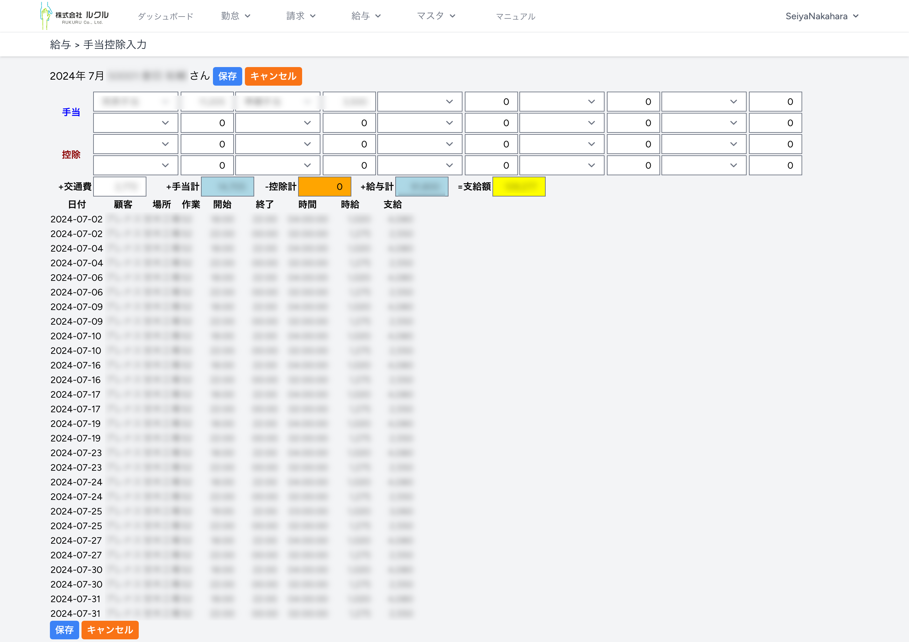

### 5. 給与計算
#### 5.1. 手当控除入力
給与を計算するために、従業員の手当控除を入力します。上部メニューで給与＞手当控除入力を選んでください。

手当控除を入力する従業員の［登録］［編集］をクリックします。

#### 5.2. 給与計算
手当控除を入力すると支給額を計算できます。上部メニューで給与＞給与計算を選んでください。

［給与出力］をクリックすると従業員の給与支給額Excelがダウンロードされます。

［給与明細出力］をクリックすると給与明細Excelがダウンロードされます
