### 2. マスタ登録
#### 2.1 祝日
休日を判断するために、毎年の祝日を登録します。上部メニューでマスタ＞祝日を選んでください。

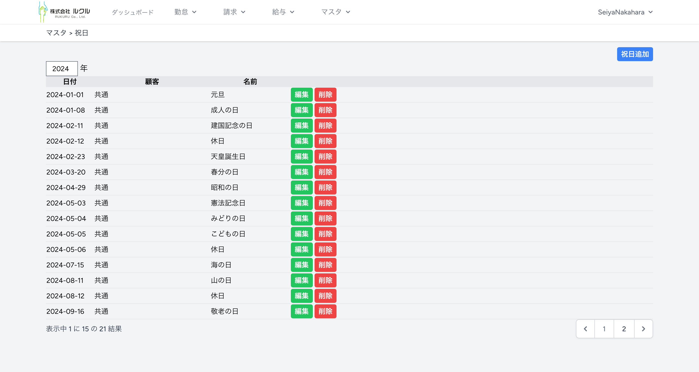

> [!TIP]
> 今年の祝日を元に、翌年の祝日をコピーで作成するボタンを追加予定です。
> 少しお待ち下さい。

画面左上の西暦年を変更すると、その年の祝日が表示されます。［祝日追加］で新しい祝日を追加できます。［編集］で日付や名称を変更できます。［削除］で祝日を削除できます。
下は祝日の追加、編集で表示される詳細画面です。

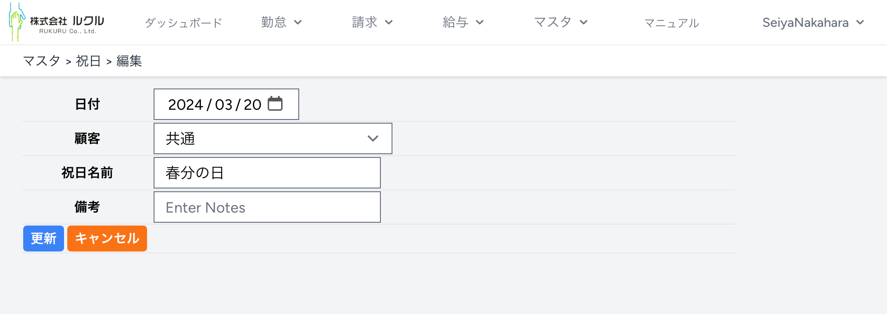

この画面で日付と祝日名前を入力、変更できます。

> [!IMPORTANT]
> 顧客専用の祝日を登録する機能がありますが、今のシステム バージョンではサポート対象外です。
#### 2.２ 顧客
上部メニューでマスタ＞顧客を選ぶと顧客の一覧が表示されます。

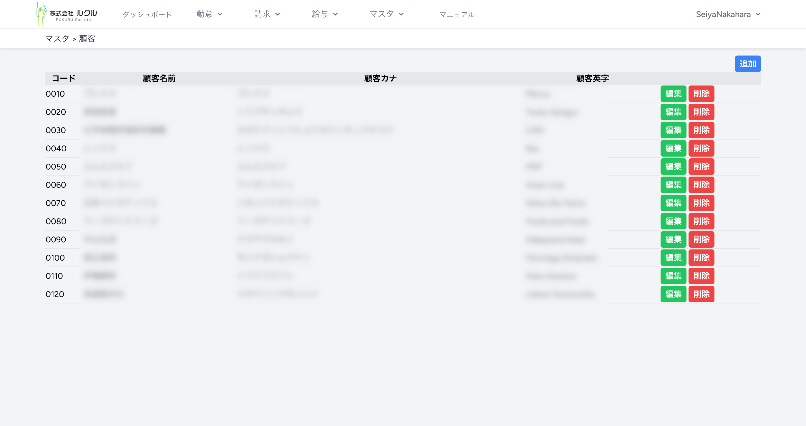

> [!WARNING]
> 一度顧客を削除すると、同じコードや名称で登録しても別の顧客として扱われます。
> 顧客に関わる勤怠や請求が不要になるまで、顧客を削除しないようにしましょう。

下は顧客の追加、編集で表示される詳細画面です。

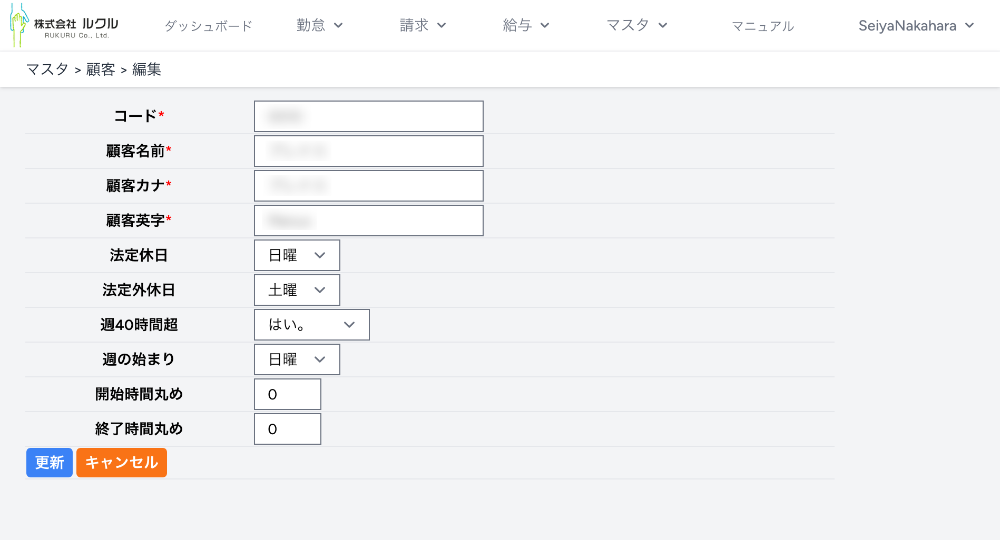

|#|項目|必須|説明|
|-|----|----|----|
|01|コード|◯|顧客に割り当てるコードを8文字以内で指定します。後から変更可能です。他の顧客と重複できません。|
|02|顧客名前|◯|顧客に割り当てるコードを8文字以内で指定します。後から変更可能です。請求書に印字されるので正規の名称を設定します。|
|03|顧客カナ|◯||
|04|顧客英字|◯||
|05|法定休日|||
|06|法定外休日|||
|07|週40時間超||この顧客での作業が週40時間を超える分を残業として扱う場合”はい”を選択します。|
|08|週の始まり||週40時間超の計算で、集計を開始する週を設定します。|
|09|開始時間丸め||開始時間を丸める分数を設定します。ゼロの場合は打刻通りに計算します。|
|10|終了時間丸め||終了時間を丸める分数を設定します。ゼロの場合は打刻通りに計算します。|
#### 2.3 部門
上部メニューでマスタ＞部門を選ぶと顧客部門の一覧が表示されます。

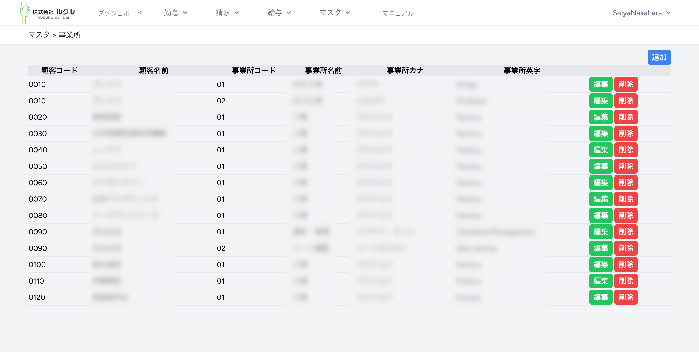

> [!WARNING]
> 一度部門を削除すると、同じコードや名称で登録しても別の部門として扱われます。
> 部門に関わる勤怠や請求が不要になるまで、削除しないようにしましょう。

下は部門の追加、編集で表示される詳細画面です。

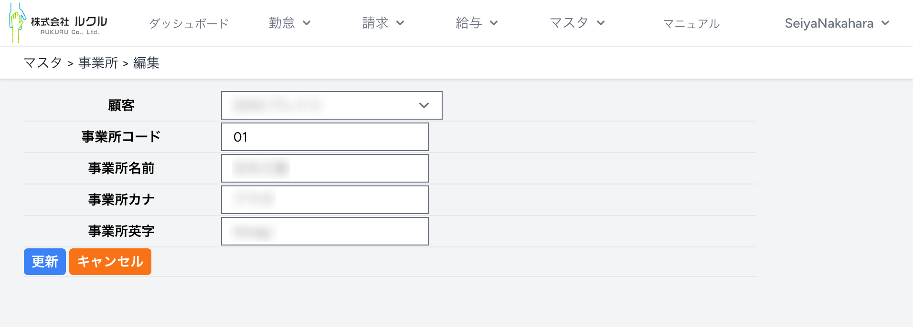

|#|項目|必須|説明|
|-|----|----|----|
|01|顧客|◯|この部門の顧客を選択します。|
|02|部門コード|◯|部門に割り当てるコードを8文字以内で指定します。後から変更可能です。|
|03|部門名前|◯|部門に割り当てるコードを8文字以内で指定します。後から変更可能です。請求書に印字されます。|
|04|部門カナ|◯||
|05|部門英字|◯||
#### 2.4 作業種別
上部メニューでマスタ＞作業種別を選ぶと作業種別の一覧が表示されます。

作業種別の一覧は顧客や部門を選択して絞り込みできます。

> [!TIP]
> 作業種別がシステムの一番大事な設定です。

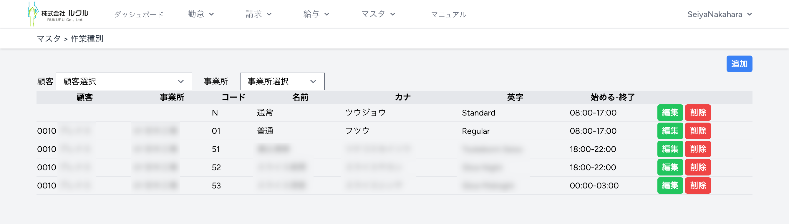

下は作業種別の追加、編集で表示される詳細画面です。

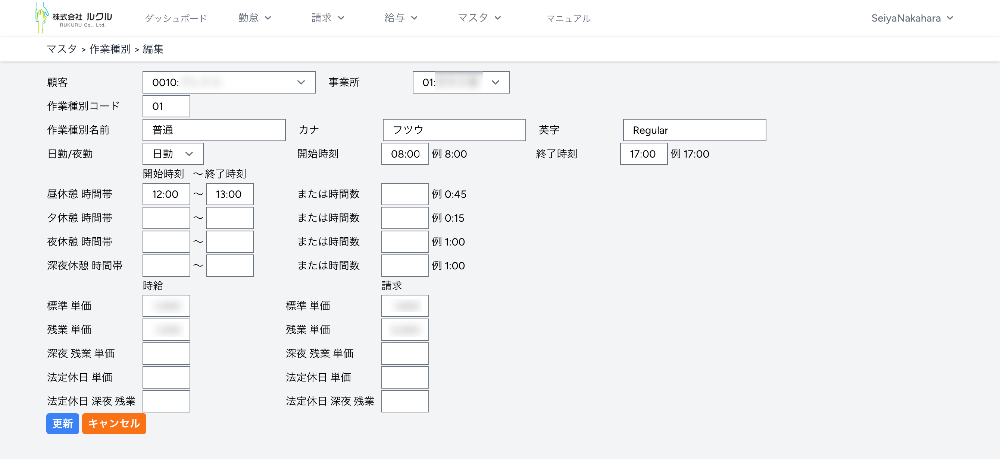

|#|項目|必須|説明|
|-|----|----|----|
|01|顧客||この作業種別を特定の顧客で使う場合に、顧客を指定します。顧客を選択しない場合、全ての顧客で使用されます。|
|02|部門||この作業種別を特定の顧客部門で使う場合に、顧客を指定します。部門を設定するには顧客を選択しておく必要があります。部門を選択しない場合、全ての部門で使用されます。|
|03|作業種別コード|◯|作業種別に割り当てるコードを8文字以内で指定します。|

> [!WARNING]
> 現バージョンでは作業種別コードを変更すると請求や給与計算に影響します。
> 将来のバージョンで作業種別コードを変更できるようになります。

|#|項目|必須|説明|
|-|----|----|----|
|11|作業種別名前|◯|作業種別の名前です。|
|12|作業種別カナ|◯||
|13|作業種別英字|◯||
|14|日勤夜勤|◯|日勤か夜勤を選択してください。|
|15|開始時刻|◯|この作業の始業時刻です。開始打刻が始業時刻よりも早い場合、残業とみなされる場合があります。|
|16|終了時刻|◯|この作業の終業時刻です。終了打刻が終業時刻よりも遅い場合、残業とみなされる場合があります。|

> [!TIP]
> 作業種別には昼、夕方、夜、深夜の４つの休憩を設定することができます。

> [!WARNING]
> 休憩は休憩開始時刻と休憩終了時刻で指定するか、または休憩時間数で指定します。混在してはいけません。

|#|項目|必須|説明|
|-|----|----|----|
|21|昼休憩開始時刻||昼休憩がある場合の開始時刻です。|
|22|昼休憩終了時刻||昼休憩がある場合の終了時刻です。|

夕方、夜、深夜休憩の開始、終了時刻も昼休憩と同様です。

> [!TIP]
> 作業種別には時給と請求額を設定することができます。

|#|項目|必須|説明|
|-|----|----|----|
|31|標準時給|◯|どの時間帯が標準時給になるかは作業種別によります。|
|32|残業時給||どの時間帯が残業時給になるかは作業種別によります。|
|33|深夜残業時給||どの時間帯が深夜残業時給になるかは作業種別によります。|
|34|法定休日時給||どの時間帯が法定休日時給になるかは作業種別によります。|
|35|法定休日深夜残業時給||どの時間帯が法定休日深夜残業時給になるかは作業種別によります。|

|#|項目|必須|説明|
|-|----|----|----|
|31|標準請求|◯|どの時間帯が標準請求になるかは作業種別によります。|
|32|残業請求||どの時間帯が残業請求になるかは作業種別によります。|
|33|深夜残業請求||どの時間帯が深夜残業請求になるかは作業種別によります。|
|34|法定休日請求||どの時間帯が法定休日請求になるかは作業種別によります。|
|35|法定休日深夜残業請求||どの時間帯が法定休日深夜残業請求になるかは作業種別によります。|
#### 2.5 手当控除項目
上部メニューでマスタ＞手当控除項目を選ぶと、手当控除項目の一覧が表示されます。

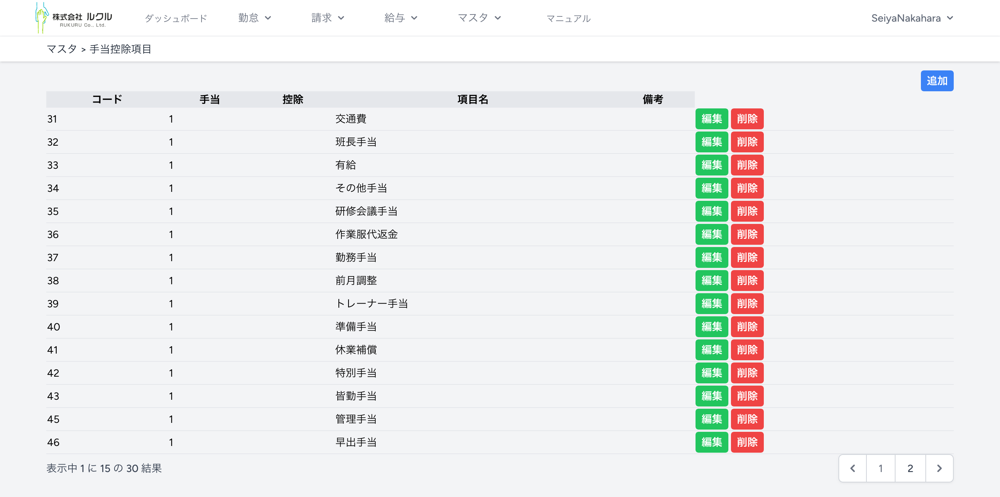

下は手当控除項目の追加、編集で表示される詳細画面です。

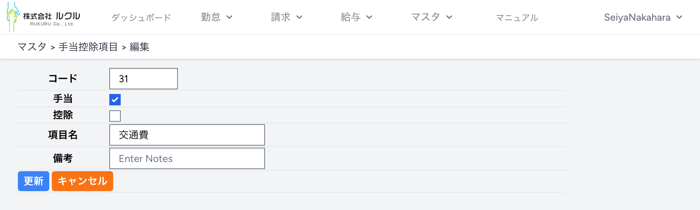

|#|項目|必須|説明|
|-|----|----|----|
|01|コード|◯|手当控除項目に割り当てるコードを8文字以内で指定します。後から変更可能です。|
|02|手当||手当として使う場合にチェックします。|
|03|控除||控除として使う場合にチェックします。|
|04|項目名|◯|手当控除項目の名前です。後から変更可能です。|
#### 2.6 従業員
上部メニューでマスタ＞従業員を選ぶと、従業員の一覧が表示されます。

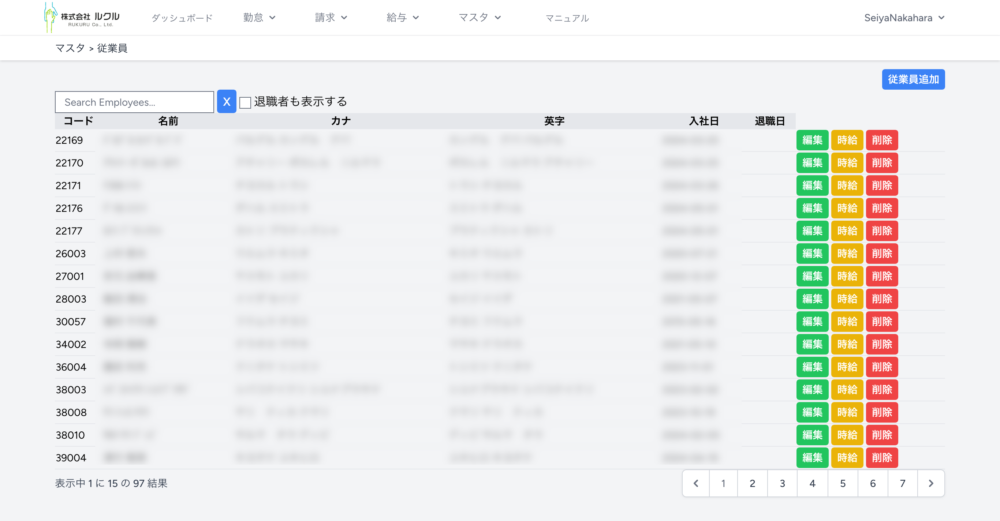

> [!TIP]
> ［時給］は作業種別で設定した時給や請求単価と異なる金額を設定する場合に使用します。

下は従業員の追加、編集で表示される詳細画面です。

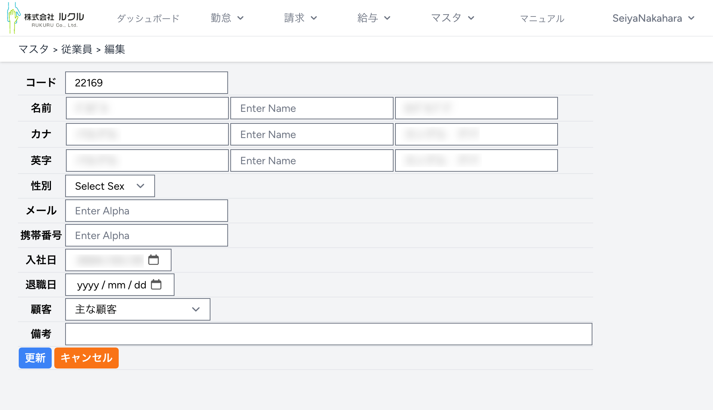

|#|項目|必須|説明|
|-|----|----|----|
|01|コード|◯|従業員コードを8文字以内で指定します。後から変更可能です。|
|02|名前|◯|姓、ミドル、名を入力します。|
|03|名前カナ|◯|姓、ミドル、名を入力します。|
|04|名前英字|◯|姓、ミドル、名を入力します。|
|05|性別||性別を選択できます。|
|06|メール||メールアドレスを入力できます。|
|07|携帯番号||携帯番号を入力できます。|
|08|入社日||入社日を入力できます。|
|09|退職日||退職日を入力できます。|
|10|主な顧客||顧客を選択できます。|

下は従業員の時給で表示される詳細画面です。

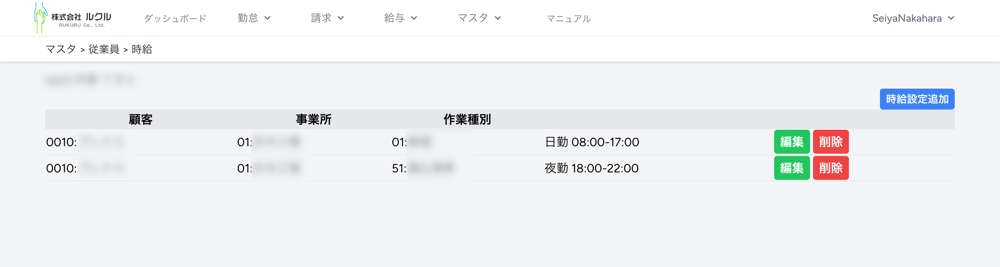

下は従業員時給の追加、編集で表示される詳細画面です。

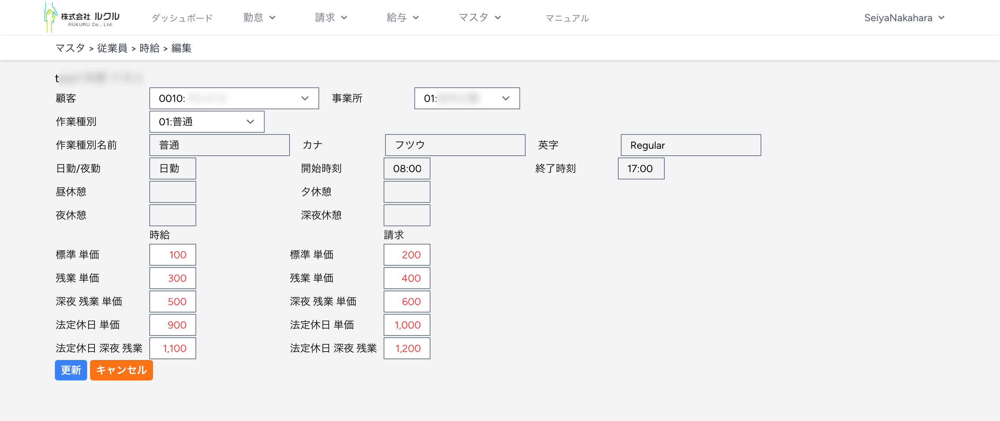

|#|項目|必須|説明|
|-|----|----|----|
|01|顧客||決まった顧客の作業種別について設定する場合は、顧客を選択します。|
|02|部門||決まった顧客部門の作業種別について設定する場合は、部門を選択します。|
|03|作業種別|◯|作業種別は必ず選択してください。選択できる作業種別は顧客、部門によって変わります。|
|04|時給||この従業員について、選んだ顧客、部門、作業種別について時給を設定できます。|
|05|請求||この従業員について、選んだ顧客、部門、作業種別について請求単価を設定できます。|
#### 2.7 アカウント
上部メニューでマスタ＞アカウントを選ぶとアカウントの一覧が表示されます。

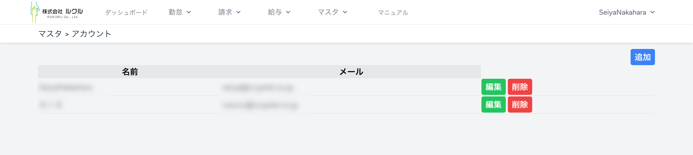

下はアカウントの追加、編集で表示される詳細画面です。

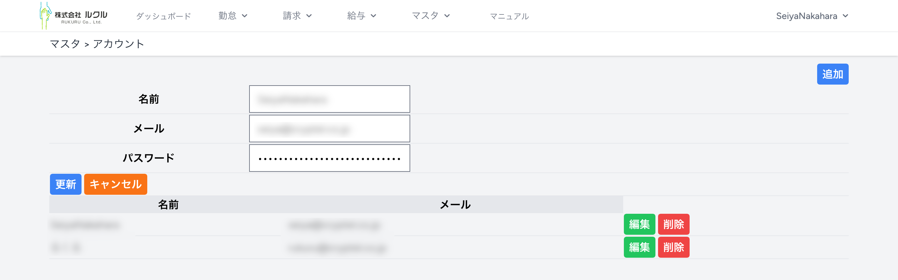

|#|項目|必須|説明|
|-|----|----|----|
|01|名前|◯|アカウントの名前を入力します。|
|02|メール|◯|アカウントのメールアドレスを入力します。今後のバージョンアップでパスワードのリセットに使用します。|
|03|パスワード|◯|ログインに使うパスワードを入力します。|
