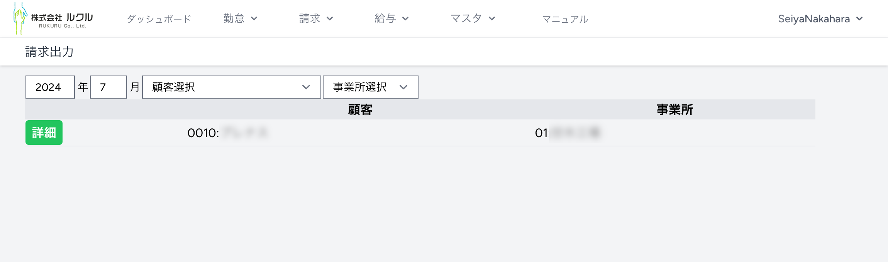

### 4. 請求出力
#### 4.1. 請求出力
請求書は年月を指定して出力します。上部メニューで請求＞請求出力を選んでください。

請求書を出力する顧客、部門の［詳細］をクリックします。

［請求出力］をクリックすると請求書Excelがダウンロードされます。
［請求明細出力］をクリックすると請求書明細Excelがダウンロードされます。

> [!NOTE]
> 請求書や請求明細のExcel雛形（テンプレート）は変更可能です。
